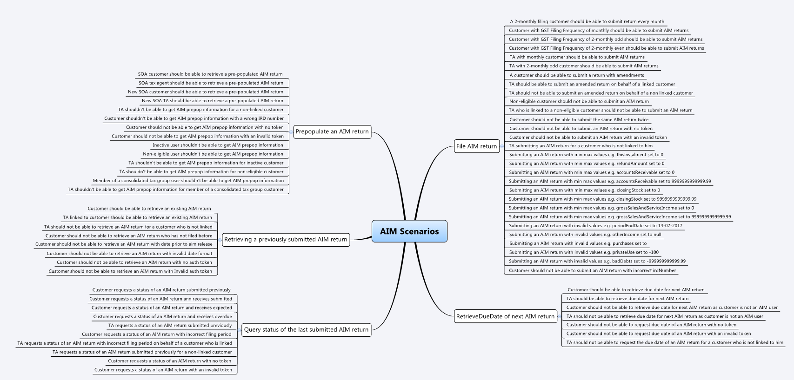

AIM Returns Software Development Kit(SDK)
===============================================

# Release version 1.0

Key Documentation:
-------------

- Business use cases and worked examples
	- [view on IR website](https://www.ird.govt.nz/resources/5/0/50d56274-2a12-46ac-a9e3-a4a84d3f47bc/aim-business-use-cases-worked-examples.pdf)
	
- Schemas and WSDLS
	- View and download the [common v1 xsd](../../../Schema%20-%20Common/)
	- View and download the [return service common v1 xsd](../../../Service%20-%20Return/Latest/)
	- View and download the AIM return [xsd](ReturnAIM.v1.xsd) and [wsdl](ReturnsAIMDevWsdl.v1.wsdl) from this current directory
	
- Return Service 
	- [Download the Return Service AIM v1.0 build pack](../../../Service%20-%20Return/Archive/Gateway%20Services%20Build%20Pack%20-%20Return%20Service%20-%20AIM%20v1.0.pdf) to view data definitions of each operation and response status code definitions

- Message Samples
    - [View Message samples for requests and positive responses](#message-samples)		
	
- Mock Environment Information
	- [Mindmap and test data](#mock-environment-information)
	- [Requests Matching Logic](#mock-environment-requests-matching-logic)
	
- Test Environment Information
	- [Test scenarios report template, mindmap and data](#test-environment-information)
	
- Identity and Access Service
	- [How to Integrate with OAuth](../../../Service%20-%20Identity%20and%20Access/Latest/OAuth%20Authentication%20-%20How%20to%20Integrate.md)
	- [Sample curl commands](../../../Service%20-%20Identity%20and%20Access/Latest/OAuth%20Authentication%20-%20How%20to%20Integrate.md) - for testing the OAuth flow
	- [Message Samples](../../../Service%20-%20Identity%20and%20Access/Latest/) - OAuth requests and responses
	- [Download the build pack](../../../Service%20-%20Identity%20and%20Access/Latest/Build%20pack%20-%20Identity%20and%20Access%20Services.pdf) - for OAuth 2.0 implementation   

Message samples:
-----------------

- Simulating AIM Returns Operations:
    - PrePop
        - Positive response
            - [request sample](sample%20messages/body-aim-returnprepop-request.xml)
            - [response sample](sample%20messages/body-aim-returnprepop-response.xml)
    - File
        - Positive response
            - [request sample](sample%20messages/body-aim-returnfile-request.xml)
            - [response sample](sample%20messages/body-aim-returnfile-response.xml)
    - RetrieveStatus
        - Positive response
            - [request sample](sample%20messages/body-aim-returnstatus-request.xml)
            - [response sample](sample%20messages/body-aim-returnstatus-response.xml)
    - RetrieveFilingObligations
        - Positive response
            - [request sample](sample%20messages/body-aim-filingobligation-request.xml)
            - [response sample](sample%20messages/body-aim-filingobligation-response.xml)
    - RetrieveReturn
        - Positive response
            - [request sample](sample%20messages/body-aim-retrievereturn-request.xml)
            - [response sample](sample%20messages/body-aim-retrievereturn-response.xml)

Mock Environment Information:
-----------------

- AIM Mock Scenarios Mindmap
	
	[View Larger Image](../../images/AIM_Mock_Scenarios_Mindmap.png)
	

- Test Data
	- The following test data can be tested in our Mock Services environment when submitting requests to the service operations
	- This table shows which scenarios (as per their numbers in the mindmap) require specific data to trigger the expected responses. 
	- Text in italics represents the name of the XML node in the request.
	-
	
	Operation | Scenario ID | Data
	--- | --- | ---
	File | EMS_AIM0183 | Customer IRD (*identifier*): 123090918
	RetrieveFilingObligations | EMS_AIM042 | Customer IRD (*identifier*): 123064887 
	Prepop | EMS_AIM054 | Customer IRD (*identifier*): abcdefgh 
	Prepop | EMS_AIM063 | Customer IRD (*identifier*): 123064887 
	Prepop | EMS_AIM059 | Customer IRD (*identifier*): 123066081 
	RetrieveReturn | EMS_AIM028 | Customer IRD (*identifier*): 123081420 
	RetrieveStatus | EMS_AIM065 | Customer IRD (*identifier*): 123090918 
	 | | | *periodEndDate*: 2019-12-31 
	RetrieveStatus | EMS_AIM066 | Customer IRD (*identifier*): 123090918
	 | | | *periodEndDate*: 2017-12-31 
	RetrieveStatus | EMS_AIM034 | Customer IRD (*identifier*): 123090918 (two-monthly even filer)
	 | | | *periodEndDate*: 2017-11-30 

            
Mock Environment - Requests Matching Logic:
-----------------

- ReadMe Page - (default) port 8080 of root path of Welcome Page
- Authentication mappings - (default) port 8443 of following paths:
	- /ms_oauth/oauth2/endpoints/oauthservice/authorize
	- /oam/server/auth_cred_submit
	- /ms_oauth/oauth2/endpoints/oauthservice/tokens
- Returns Service Mappings - (default) port 8080 of path "/gateway/GWS/Returns":
	- /gateway/GWS/Returns?wsdl - wsdl is not available, returning http 200 only
	- /gateway/GWS/Returns - Authentication validation will be performed at first:
		- if fail then return Authentication Errors
		- if pass then:
			- XML validation will be performed:
				- if fail then return XML Validation Errors
				- if pass then return positive responses
- Default Mapping - Very last matching logic to handle all other requests by returning 404 error when no matching found

Test Environment Information:
-----------------

- Test Scenarios
	- [Download test scenarios report template](AIM%20-%20Return%20Sevice%20-%20Test%20Report%20Template.docx)
	- AIM Test Scenarios Mindmap [View Larger Image](../../images/AIM_Test_Scenarios_Mindmap.png)
	
	