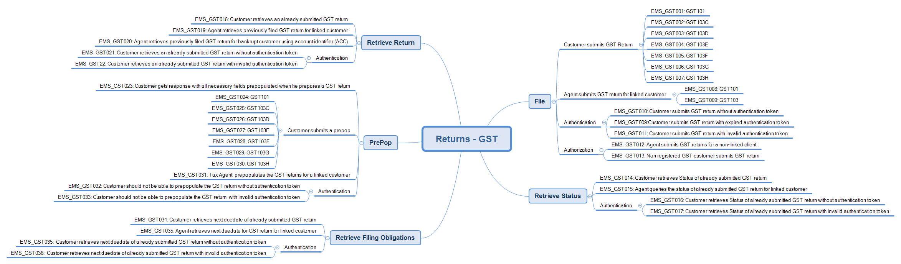

# GST Returns Software Development Kit (SDK)

#### Release version 1.0

## About the service

* Goods and services tax (GST) is a 15% tax added to the price of most goods and services in New Zealand, including imported goods and services.
* The gateway service used for GST is the Return service that enables
	- filing of returns in real time
	- amending of returns
	- retrieve a return due date
	- query a return status
	- retrieve previously filed returns

## Key documentation:

- Business use cases
	- [view and download](GST-Business-use-cases.pdf)
	
- Schemas and WSDLs
	- View and download the [common v1 xsd](../Common%20XSD/Common.v1.xsd)
	- View and download the [return service common v1 xsd](../Common%20XSD/ReturnCommon.v1.xsd)
	- View and download the GST return [XSD](ReturnGST.v1.xsd) and [WSDL](ReturnsGSTDevWsdl.v1.wsdl) from this current directory

- Build pack 
	- [Download the Return service GST build pack](Gateway%20Services%20Build%20Pack%20-%20Return%20Service%20-%20GST.pdf) to view data definitions of each operation and response status code definitions

- GST Forms 
    - [Standard GST Returns](#Standard-GST-Returns)

- Message samples
    - [View message samples for requests and positive responses](#message-samples)
	
## Environment information

- [Mock environment information - emulated services, mindmap and test data](#mock-environment-information)
	
- [Test environment information - Test scenarios report template, mindmap and URL endpoints](#test-environment-information)

- [Production environment information - URL endpoints](#Production-Environment-Information)	

## Supporting services

* Service: Identity and Access – view [how to integrate, OAuth requests, message samples and build pack](https://github.com/InlandRevenue/Gateway_Services-Access/tree/master/Identity%20and%20Access) 
* Service: Intermediation – view [schemas, WSDLs, and build pack](https://github.com/InlandRevenue/Gateway_Services-Access/tree/master/Service%20-%20Intermediation)

## Standard GST Returns

| Form Type| Return Type | Description |
| :--: | -- | -- |
| GST 101A  | Goods and Services Tax return | For customers to file a GST return according to their filing frequency. |
| GST 103B | GST and provional Tax Return - **Available internet only** | For customers who have lost their paper returns or cannot access online filing, this is also referred to as the disaster recover return **Web PDF only.** | 
| GST 103C | GST and provional Tax Return | Ratio option, one monthly, single location filer - compulsory payment period. | 
| GST 103D | GST and provional Tax Return | Ratio option, two monthly, single location filer - compulsory payment period.|
| GST 103E | GST and provional Tax Return | Ratio option, one monthly, multi-location filer - compulsory payment period. |
| GST 103F | GST and provional Tax Return | Ratio option, two monthly, multi-location filer - compulsory payment period. |
| GST 103G | GST and provional Tax Return | Standard and estimate (Non-Ratio) filers - compulsory payment period. |
| GST 103H | GST and provional Tax Return | Ratio Standard and estimate filers - voluntary payment period. |

## Message samples
-----------------

* Simulating GST returns operations:
    - PrePop
        - Positive response
            - [request sample](sample%20messages/body-gst-returnprepop-request.xml)
            - [response sample](sample%20messages/body-gst-returnprepop-response.xml)
    - File
        - Positive response
            - [request sample GST 101A](sample%20messages/body-gst-returnfile-request-GST101A.xml)
			- [request sample GST 103C](sample%20messages/body-gst-returnfile-request-GST103C.xml)
			- [request sample GST 103D](sample%20messages/body-gst-returnfile-request-GST103D.xml)
			- [request sample GST 103E](sample%20messages/body-gst-returnfile-request-GST103E.xml)
			- [request sample GST 103F](sample%20messages/body-gst-returnfile-request-GST103F.xml)
			- [request sample GST 103G](sample%20messages/body-gst-returnfile-request-GST103G.xml)
			- [request sample GST 103H](sample%20messages/body-gst-returnfile-request-GST103H.xml)
            - [response sample](sample%20messages/body-gst-returnfile-response.xml)
    - RetrieveStatus
        - Positive response
            - [request sample](sample%20messages/body-gst-returnstatus-request.xml)
            - [response sample](sample%20messages/body-gst-returnstatus-response.xml)
    - RetrieveFilingObligations
        - Positive response
            - [request sample](sample%20messages/body-gst-filingobligation-request.xml)
			- [response sample](sample%20messages/body-gst-filingobligation-response.xml)
    - RetrieveReturn
        - Positive response
            - [request sample](sample%20messages/body-gst-retrievereturn-request.xml)
			- [request sample](sample%20messages/body-gst-retrievereturn-ACC-Identifer.xml) ACC Identifer
            - [response sample](sample%20messages/body-gst-retrievereturn-response.xml)

## Mock environment information
-----------------

* Mock emulated services URL
	*  https://gst.test.services.ird.govt.nz

* Test scenarios
	- GST mock scenarios mindmap
	
	

* Test data
	- The following test data can be tested in our Mock Services environment when submitting requests to the service operations
	- This table shows which scenarios (as per their numbers in the mindmap) require specific data to trigger the expected responses. 
	- Text in italics represents the name of the XML node in the request.
	
	    
	|Operation | Scenario ID | Data|
	|-|-|-|
	|File | EMS_GST013 | Customer IRD (*identifier*): 123090918|
	|File | EMS_GST012 | Customer IRD (*identifier*): 123039456|
	|Prepop | EMS_GST027 | Customer IRD (*identifier*): 123039858 |
	|Prepop | EMS_GST028 | Customer IRD (*identifier*): 123084226 |
	|Prepop | EMS_GST029 | Customer IRD (*identifier*): 123084217|
	|Prepop | EMS_GST030 | Customer IRD (*identifier*): 123088077|
	|Prepop | EMS_GST031 | Customer IRD (*identifier*): 123070054 |
	|Prepop | EMS_GST032 | Customer IRD (*identifier*): 123101294|
	|Prepop | EMS_GST033 | Customer IRD (*identifier*): 123084225 |
    |Prepop | EMS_GST034 | Customer IRD (*identifier*): 123080106 |
	
* Test scenarios
	- [Download mock test scenarios report template](Mock%20-%20GST%20Returns%20Service%20-%20Test%20Report%20Template.docx)	
        
## Test environment information
-----------------

* Test scenarios
	- [Download test scenarios report template](GST%20-%20Return%20Service%20-%20Test%20Report%20Template.docx)

* Test environment URL endpoints
	
	* Cloud gateway service: https://test5.services.ird.govt.nz:4046/gateway/gws/returns/
	* Native desktop gateway service: https://test5.services.ird.govt.nz/gateway2/gws/returns/
	* Cloud SOAP WSDL: https://test5.services.ird.govt.nz:4046/gateway/gws/returns/?wsdl
	* Native desktop SOAP WSDL: https://test5.services.ird.govt.nz/gateway2/gws/returns/?wsdl
            
## Production environment information
-----------------

* Production URL endpoints

	- Cloud gateway service: https://services.ird.govt.nz:4046/gateway/gws/returns/
	- Native desktop gateway service: https://services.ird.govt.nz/gateway2/gws/returns/
	- (Cloud) SOAP WSDL: https://services.ird.govt.nz:4046/gateway/gws/returns/?wsdl
	- (Native desktop) SOAP WSDL: https://services.ird.govt.nz/gateway2/gws/returns/?wsdl
