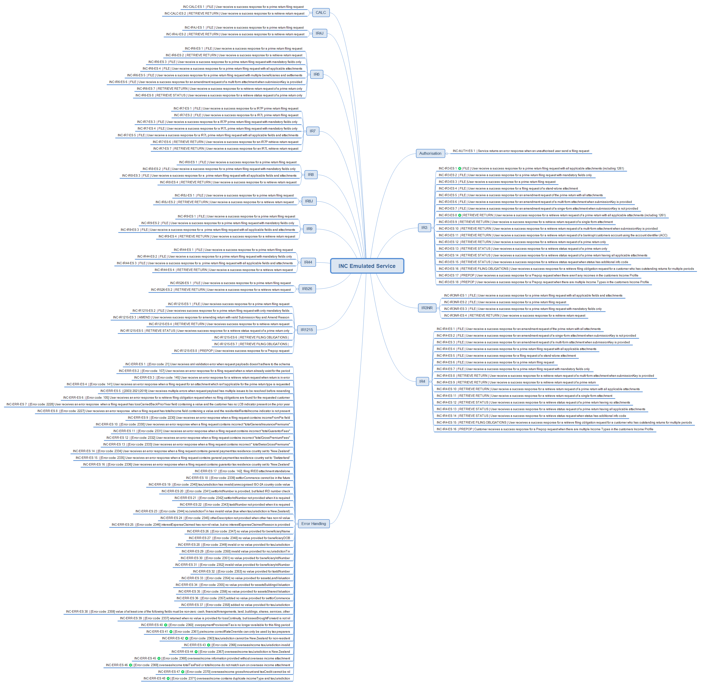

<br/>


# Income Tax - Testing Information

## Key Documentation:

- The testing details provided on this page is applicable for all of the following invest income reporting tax types
	- Income Tax Returns (INC)
	- Donation Tax Credit (DTC/REB/IR5216)	

* XSD Schemas 
    * View and download the Income Tax XSD schema files from the [xsd](../xsd/) directory
    * View and download the [return service common v2 xsd](../../Common%20XSD/)
    * View and download the [common v2 xsd](../../Common%20XSD/)	
	
- Mock Environment Information
	- [Mindmap and test data](#mock-environment-information)
		
- Test Environment Information
	- [Test scenarios report template](#test-environment-information)
	- [Test Environment URLs](#test-urls)
	
- Production Environment Information
	- [Production Environment URLs](#production-environment-information)
	

---

## Mock Environment Information
---
- Mock Emulated Services URL
    - Landing page:  https://incometax.test.services.ird.govt.nz
    - Service endpoint:  https://incometax.test.services.ird.govt.nz/gateway/GWS/Returns/
- Test Scenarios
    - Income Tax Mock Scenarios Mind map 
    [Mock Scenarios](images/Emulated_Service_IncomeTax_Coverage_with_AC_2023.png)
     
- Test Data
    - This table shows which scenarios (as per their numbers in the mind map) require specific data to trigger the expected responses.
    - Text in italics represents the name of the XML node in the request.
	- **For all retrieve return scenarios, the periodEndDate must be 2021-03-31.**
    

|     Form Type            	|     New Scenario ID          	|     Operation                    	|     Data                                                                                               	|
|--------------------------	|------------------------------	|----------------------------------	|--------------------------------------------------------------------------------------------------------	|
|     IR3                  	|     INC-IR3-ES   8           	|     RetrieveReturn               	|     Customer   IRD (identifier): 132310297                                                             	|
|                          	|     INC-IR3-ES   11          	|     RetrieveReturn               	|     Customer   ACC (identifier): 139562127INC003                                                       	|
|                          	|     INC-IR3-ES   14          	|     RetrieveStatus               	|     Customer   IRD (identifier): 132310297                                                             	|
|                          	|     INC-IR3-ES   15          	|     RetrieveStatus               	|     Customer   IRD (identifier): 070876272                                                             	|
|                          	|     INC-IR3-ES   17          	|     Prepop                       	|     Customer   IRD (identifier): 015679840                                                             	|
|                          	|     All   other scenarios    	|                                  	|     Customer   IRD (identifier): 132306907                                                             	|
|     IR3NR                	|     All   scenarios          	|                                  	|     Customer   IRD (identifier): 093989910                                                             	|
|     IR4                  	|     INC-IR4-ES   10          	|     RetrieveReturn               	|     Customer   IRD (identifier): 132329362                                                             	|
|                          	|     INC-IR4-ES   13          	|     RetrieveStatus               	|     Customer   IRD (identifier): 132329362                                                             	|
|                          	|     INC-IR4-ES   14          	|     RetrieveStatus               	|     Customer   IRD (identifier): 107031227                                                             	|
|                          	|     All   other scenarios    	|                                  	|     Customer   IRD (identifier): 096062311                                                             	|
|     IR4J                 	|     All   scenarios          	|                                  	|     Customer   IRD (identifier): 078445386                                                             	|
|     IR6                  	|     All   scenarios          	|                                  	|     Customer   IRD (identifier): 079945793                                                             	|
|     IR7                  	|     INC-IR7-ES   1           	|     File                         	|     Customer   IRD (identifier): 019515842                                                             	|
|                          	|     INC-IR7-ES   2           	|     File                         	|     Customer   IRD (identifier): 105493711                                                             	|
|                          	|     INC-IR7-ES   6           	|     RetrieveReturn               	|     Customer   IRD (identifier): 019515842                                                             	|
|                          	|     INC-IR7-ES   7           	|     RetrieveReturn               	|     Customer   IRD (identifier): 105493711                                                             	|
|     IR8                  	|     All   scenarios          	|                                  	|     Customer   IRD (identifier): 050700461                                                             	|
|     IR8J                 	|     All   scenarios          	|                                  	|     Customer   IRD (identifier): 113613831                                                             	|
|     IR9                  	|     All   scenarios          	|                                  	|     Customer   IRD (identifier): 056632778                                                             	|
|     IR44                 	|     All   scenarios          	|                                  	|     Customer   IRD (identifier): 052120330                                                             	|
|     IR526                	|     All   scenarios          	|                                  	|     Customer   IRD (identifier): 055786372                                                             	|
|     Authorisation        	|     INC-AUTH-ES   1          	|     All                          	|     Customer   IRD (identifier): 111001111                                                             	|
|     Error   Scenarios    	|     INC-ERR-ES   2           	|     File                         	|     IR9   Return with multiple IR10 attachments                                                        	|
|                          	|     INC-ERR-ES   3           	|     RetrieveReturn               	|     IR4   Customer IRD (identifier): 107031227                                                         	|
|                          	|     INC-ERR-ES   4           	|     File                         	|     IR9   return with IR307 attachment                                                                 	|
|                          	|     INC-ERR-ES   5           	|     File                         	|     IR3   return with:                                                                                 	|
|                          	|                              	|                                  	|     totalPAYEDeducted > totalGrossIncome                                                               	|
|                          	|                              	|                                  	|     totalIncomeNotLiableForACCLevy > totalGrossIncome                                                  	|
|                          	|                              	|                                  	|     totalExtinguishedTCPDs > totalTCPDs                                                                	|
|                          	|     INC-ERR-ES   6           	|     RetrieveFilingObligations    	|     IR4   Customer IRD (identifier): 078650362                                                         	|
|                          	|     INC-ERR-ES   9           	|     File                         	|     IR215   standalone or attachment with:                                                             	|
|                          	|                              	|                                  	|     periodEndDate: 2021-03-31 or later                                                                 	|
|                          	|                              	|                                  	|     incomeFromPie: value > 0                                                                           	|
|                          	|     INC-ERR-ES-17            	|     File                         	|     IR3   return with:                                                                                 	|
|                          	|                              	|                                  	|     periodEndDate: 2020-03-31 or earlier                                                               	|
|                          	|                              	|                                  	|     pieIncome.totalTaxCredits > (taxOnTaxableIncome / totalTaxableIncome)   * pieIncome.totalIncome    	|
|                          	|     INC-ERR-ES   7           	|     File                         	|     IR3   return with:                                                                                 	|
|                          	|                              	|                                  	|     periodEndDate: 2021-03-31 or later                                                                 	|
|                          	|                              	|                                  	|     lossCarriedBackPriorYear: value > 0                                                                	|
|                          	|                              	|                                  	|     Customer   IRD (identifier): 132057273                                                             	|
|                          	|     INC-ERR-ES   8           	|     File                         	|     IR4   return with:                                                                                 	|
|                          	|                              	|                                  	|     periodEndDate: 2021-03-31 or later                                                                 	|
|                          	|                              	|                                  	|     residentialRentalIncome.indicator: missing                                                         	|
|                          	|                              	|                                  	|     residentialRentalIncome.totalIncome: value > 0                                                     	|


## Mock Environment Information:
-----------------

- Mock URLs:
	- Mock Emulated Services	-	 https://incometax.test.services.ird.govt.nz
	- Mock URL Endpoint			- 	 https://incometax.test.services.ird.govt.nz/gateway/GWS/Returns/

- Returns Service Mappings - (default) port 443 of path "/gateway/GWS/Returns":
	- /gateway/GWS/Returns?wsdl - WSDL is not available, returning HTTP 200 only.
	
- WS-addressing ```action``` header value of the incoming request is mapped to an endpoint:
	- FileReturns 		-	https://services.ird.govt.nz/GWS/Returns/Return/File
	- RetrieveReturns 	-	https://services.ird.govt.nz/GWS/Returns/Return/RetrieveReturn
	- RetrieveStatus 	-	https://services.ird.govt.nz/GWS/Returns/Return/RetrieveStatus
	- Prepop   	-	https://services.ird.govt.nz/GWS/Returns/Return/Prepop
	- RetrieveFilingObligations   	-	https://services.ird.govt.nz/GWS/Returns/Return/RetrieveFilingObligations
	 
- Authentication: 
	- Authentication is based on the outcome of OAuth token validation (using [OAuth emulator](https://oauth.test.services.ird.govt.nz/))
	- Access delegation/restriction is not emulated, and any authenticated user has access to the test data
	- Incoming requests should include "Authorization" header with the OAuth token value
	- In case of missing token, emulated service would respond with error statusCode 2

- Schema Validations:
	- In case of failure XML validation failure response (error code 21)

- Then the service operation specific validations are carried out and returned with appropriate response (per mind map).
- Unmatched requests will return an appropriate HTTP response status

## Test Environment Information:
-----------------

* Test Environment URL Endpoints

	* Cloud Gateway Service: `https://test5.services.ird.govt.nz:4046/gateway/gws/returns/`
	* Native Desktop Gateway Service: `https://test5.services.ird.govt.nz/gateway2/gws/returns/`
	* Cloud SOAP WSDL: `https://test5.services.ird.govt.nz:4046/gateway/gws/returns/?wsdl`
	* Native Desktop SOAP WSDL: `https://test5.services.ird.govt.nz/gateway2/gws/returns/?wsdl`
	
* Test scenarios
	* [Download test scenarios report template](../Income%20Tax%20-%20Return%20Service%20-%20Test%20Report%20Template.docx)	
	
>**NOTE:** These endpoints are subject to change due to environment updates in the future. 		
            
## Production Environment Information:
-----------------

* Production URL Endpoints

	- Cloud Gateway Service: `https://services.ird.govt.nz:4046/gateway/gws/returns/`
	- Native Desktop Gateway Service: `https://services.ird.govt.nz/gateway2/gws/returns/`
	- (Cloud) SOAP WSDL: `https://services.ird.govt.nz:4046/gateway/gws/returns/?wsdl`
	- (Native Desktop) SOAP WSDL: `https://services.ird.govt.nz/gateway2/gws/returns/?wsdl`	
   	