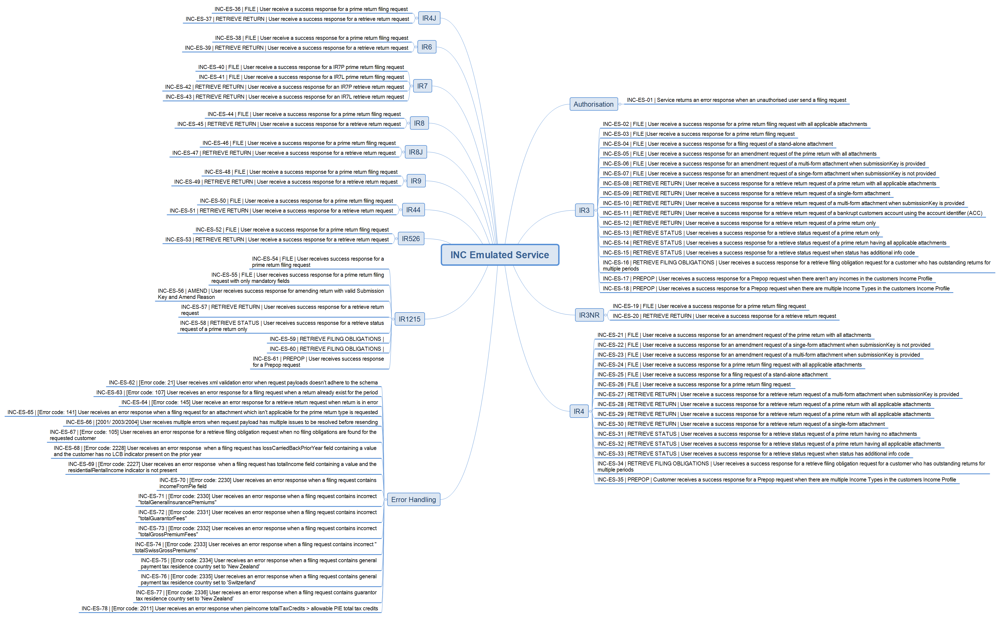

<br/>


# Income Tax - Testing Information

## Key Documentation:

- The testing details provided on this page is applicable for all of the following invest income reporting tax types
	- Income Tax Returns (INC)
	- Donation Tax Credit (DTC/REB/IR5216)	

* XSD Schemas 
    * View and download the Income Tax XSD schema files from the [xsd](../xsd/) directory
    * View and download the [return service common v2 xsd](../../Common%20XSD/)
    * View and download the [common v2 xsd](../../Common%20XSD/)	
	
- Mock Environment Information
	- [Mindmap and test data](#mock-environment-information)
		
- Test Environment Information
	- [Test scenarios report template](#test-environment-information)
	- [Test Environment URLs](#test-urls)
	
- Production Environment Information
	- [Production Environment URLs](#production-environment-information)
	

---

## Mock Environment Information
---
- Mock Emulated Services URL
    - Landing page:  https://incometax.test.services.ird.govt.nz
    - Service endpoint:  https://incometax.test.services.ird.govt.nz/gateway/GWS/Returns/
- Test Scenarios
    - Income Tax Mock Scenarios Mind map 
    [Mock Scenarios](images/Emulated_Services_IncomeTax_Coverage.png)
     
- Test Data
    - This table shows which scenarios (as per their numbers in the mind map) require specific data to trigger the expected responses.
    - Text in italics represents the name of the XML node in the request.
	- **For all retrieve return scenarios, the periodEndDate must be 2021-03-31.**
    


| Form Type       | Scenario ID         | Operation                 | Data                                                                                          |
|-----------------|---------------------|---------------------------|-----------------------------------------------------------------------------------------------|
| IR3             | INC-ES-08           | RetrieveReturn            | Customer IRD (_identifier_): 132310297                                                          |
|                 | INC-ES-11           | RetrieveReturn            | Customer ACC (_identifier_): 139562127INC003                                                    |
|                 | INC-ES-14           | RetrieveStatus            | Customer IRD (_identifier_): 132310297                                                          |
|                 | INC-ES-15           | RetrieveStatus            | Customer IRD (_identifier_): 070876272                                                          |
|                 | INC-ES-17           | Prepop                    | Customer IRD (_identifier_): 015679840                                                          |
|                 | All other scenarios |                           | Customer IRD (_identifier_): 132306907                                                          |
| IR3NR           | All scenarios       |                           | Customer IRD (_identifier_): 093989910                                                          |
| IR4             | INC-ES-28           | RetrieveReturn            | Customer IRD (_identifier_): 132329362                                                          |
|                 | INC-ES-32           | RetrieveStatus            | Customer IRD (_identifier_): 132329362                                                          |
|                 | INC-ES-33           | RetrieveStatus            | Customer IRD (_identifier_): 107031227                                                          |
|                 | All other scenarios |                           | Customer IRD (_identifier_): 096062311                                                          |
| IR4J            | All scenarios       |                           | Customer IRD (_identifier_): 078445386                                                          |
| IR6             | All scenarios       |                           | Customer IRD (_identifier_): 079945793                                                          |
| IR7             | INC-ES-40           | File                      | Customer IRD (_identifier_): 019515842                                                          |
|                 | INC-ES-41           | File                      | Customer IRD (_identifier_): 105493711                                                          |
|                 | INC-ES-40           | RetrieveReturn            | Customer IRD (_identifier_): 019515842                                                          |
|                 | INC-ES-42           | RetrieveReturn            | Customer IRD (_identifier_): 105493711                                                          |
| IR8             | All scenarios       |                           | Customer IRD (_identifier_): 050700461                                                          |
| IR8J            | All scenarios       |                           | Customer IRD (_identifier_): 113613831                                                          |
| IR9             | All scenarios       |                           | Customer IRD (_identifier_): 056632778                                                          |
| IR44            | All scenarios       |                           | Customer IRD (_identifier_): 052120330                                                          |
| IR526           | All scenarios       |                           | Customer IRD (_identifier_): 055786372                                                          |
| Authorisation   | INC-ES-01           | All                       | Customer IRD (_identifier_): 111001111                                                          |
| Error Scenarios | INC-ES-63           | File                      | IR9 Return with multiple IR10 attachments                                                     |
|                 | INC-ES-64           | RetrieveReturn            | IR4 Customer IRD (_identifier_): 107031227                                                      |
|                 | INC-ES-65           | File                      | IR9 return with IR307 attachment                                                              |
|                 | INC-ES-66           | File                      | IR3 return with:                                                                              |
|                 |                     |                           | totalPAYEDeducted > totalGrossIncome                                                          |
|                 |                     |                           | totalIncomeNotLiableForACCLevy > totalGrossIncome                                             |
|                 |                     |                           | totalExtinguishedTCPDs > totalTCPDs                                                           |
|                 | INC-ES-67           | RetrieveFilingObligations | IR4 Customer IRD (_identifier_): 078650362                                                      |
|                 | INC-ES-68           | File                      | IR215 standalone or attachment with:                                                          |
|                 |                     |                           | _periodEndDate_: 2021-03-31 or later                                                            |
|                 |                     |                           | _incomeFromPie_: value > 0                                                                      |
|                 | INC-ES-78           | File                      | IR3 return with:                                                                              |
|                 |                     |                           | _periodEndDate_: 2020-03-31 or earlier                                                          |
|                 |                     |                           | _pieIncome.totalTaxCredits_ > (_taxOnTaxableIncome_ / _totalTaxableIncome_) * _pieIncome.totalIncome_ |
|                 | INC-ES-66           | File                      | IR3 return with:                                                                              |
|                 |                     |                           | _periodEndDate_: 2021-03-31 or later                                                            |
|                 |                     |                           | _lossCarriedBackPriorYear_: value > 0                                                           |
|                 |                     |                           | Customer IRD (_identifier_): 132057273                                                          |
|                 | INC-ES-67           | File                      | IR44 return with:                                                                             |
|                 |                     |                           | _periodEndDate_: 2021-03-31 or later                                                            |
|                 |                     |                           | _residentialRentalIncome.indicator_: missing                                                    |
|                 |                     |                           | _residentialRentalIncome.totalIncome_: value > 0                                                |

## Mock Environment Information:
-----------------

- Mock URLs:
	- Mock Emulated Services	-	 https://incometax.test.services.ird.govt.nz
	- Mock URL Endpoint			- 	 https://incometax.test.services.ird.govt.nz/gateway/GWS/Returns/

- Returns Service Mappings - (default) port 443 of path "/gateway/GWS/Returns":
	- /gateway/GWS/Returns?wsdl - WSDL is not available, returning HTTP 200 only.
	
- WS-addressing ```action``` header value of the incoming request is mapped to an endpoint:
	- FileReturns 		-	https://services.ird.govt.nz/GWS/Returns/Return/File
	- RetrieveReturns 	-	https://services.ird.govt.nz/GWS/Returns/Return/RetrieveReturn
	- RetrieveStatus 	-	https://services.ird.govt.nz/GWS/Returns/Return/RetrieveStatus
	- Prepop   	-	https://services.ird.govt.nz/GWS/Returns/Return/Prepop
	- RetrieveFilingObligations   	-	https://services.ird.govt.nz/GWS/Returns/Return/RetrieveFilingObligations
	 
- Authentication: 
	- Authentication is based on the outcome of OAuth token validation (using new [OAuth emulator](https://mock-oauth.ird.digitalpartner.services/))
	- Access delegation/restriction is not emulated, and any authenticated user has access to the test data
	- Incoming requests should include "Authorization" header with the OAuth token value
	- In case of missing token, emulated service would respond with error statusCode 2

- Schema Validations:
	- In case of failure XML validation failure response (error code 21)

- Then the service operation specific validations are carried out and returned with appropriate response (per mind map).
- Unmatched requests will return an appropriate HTTP response status

## Test Environment Information:
-----------------

* Test Environment URL Endpoints

	* Cloud Gateway Service: `https://test5.services.ird.govt.nz:4046/gateway/gws/returns/`
	* Native Desktop Gateway Service: `https://test5.services.ird.govt.nz/gateway2/gws/returns/`
	* Cloud SOAP WSDL: `https://test5.services.ird.govt.nz:4046/gateway/gws/returns/?wsdl`
	* Native Desktop SOAP WSDL: `https://test5.services.ird.govt.nz/gateway2/gws/returns/?wsdl`
	
* Test scenarios
	* [Download test scenarios report template](../Income%20Tax%20-%20Return%20Service%20-%20Test%20Report%20Template.docx)	
	
>**NOTE:** These endpoints are subject to change due to environment updates in the future. 		
            
## Production Environment Information:
-----------------

* Production URL Endpoints

	- Cloud Gateway Service: `https://services.ird.govt.nz:4046/gateway/gws/returns/`
	- Native Desktop Gateway Service: `https://services.ird.govt.nz/gateway2/gws/returns/`
	- (Cloud) SOAP WSDL: `https://services.ird.govt.nz:4046/gateway/gws/returns/?wsdl`
	- (Native Desktop) SOAP WSDL: `https://services.ird.govt.nz/gateway2/gws/returns/?wsdl`	
   	