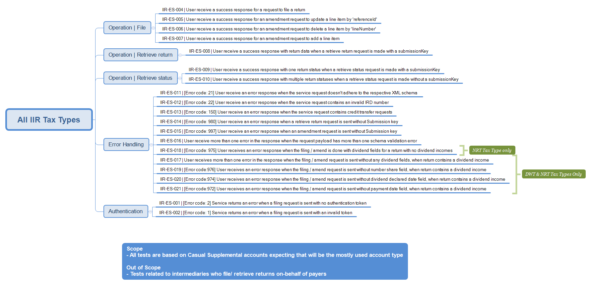

# Investment Income Reporting - Testing Information

- The testing details provided on this page is applicable for all of the following investment income reporting tax types
	- [Approved Issuer Levey (AIL)](../Product%20-%20AIL)
	- [Dividend Withholding Tax (DWT)](../Product%20-%20DWT)
	- [Interest Pay as you go (IPS)](../Product%20-%20IPS)
	- [Non Resident Withholding Tax (NRT)](../Product%20-%20NRT)
	- [Resident Withholding Tax (RWT)](../Product%20-%20RWT)
	- [Portfolio Investment Entities (PIE)](../Product%20-%20PIE)

- Mock environment information
	- [Mind map and test data](#mock-environment-information)
	- [Emulated requests matching logic](#mock-environment-requests-matching-logic)
	
- Test environment information
	- [Test scenarios report template](#test-environment-information)
	- [Test environment URLs](#test-urls)
	
- Production environment information
	- [Production environment URLs](#production-environment-information)
	
-----------------
	
## Mock environment information

- Investment Income Reporting mock scenarios mind map
	
	- [View larger image](images/IIR-mockServiceScope-scenarios.png)
	

	- Investment Income Reporting mock scenarios mind map for PIE
	
	- [View larger image](images/C42%20-%20PIE%20Emulated%20Service%20ScenariosV1_4.jpg)
	

- Test data
	- The following test data can be tested in our mock services environment when submitting requests to the service operations for the following invest income reporting tax types (AIL / DWT/ IPS/ NT / RWT)
	
		- Valid Identifiers per tax type:
			- AIL: 	[123768566, 132145202]
			- DWT:	[123769066, 132145202]
			- IPS: 	[123752058, 132145202]
			- NRT: 	[123768973, 132145202]
			- RWT: [123768736, 132145202]

		- Valid submission keys:
			- these can be used across all IIR tax types and operations:
			- [294502400, 1333370880, 463962112, 1859829760, 1699905536, 1154154496, 1783480320]
			
		- Valid primary IRD numbers: [123671791, 123769651] 
		
	- This following table shows which scenarios (as per their numbers in the mindmap) require specific data to trigger the expected responses.
	- Text in italics represents the name of the XML node in the request.
	
	

| Test ID | Test Module  | Example Data | Remarks |
| --- | --- | --- | --- |
| <span style="white-space: nowrap;">IIR-ES-001</span> |  Authentication            | -                      |  Set no authentication token |
| IIR-ES-002 |  Authentication            | -                      |  Set invalid authentication |token |
| IIR-ES-004 |  File Operation            | `132145202`               |  Set valid IRD number / |identifier value |
| IIR-ES-005 |  File Operation            | `11`                      |  Set reference Id, amendType 'U' |
| IIR-ES-006 |  File Operation            | `5312572871`              |  Set lineNumber, amendType 'D' |
| IIR-ES-007 |  File Operation            | `132145202`               |  AmendType 'A' |
| IIR-ES-008 |  Retrieve Return Operation | `294502400`               |  Include submissionKey |
| IIR-ES-009 |  Retrieve Status Operation | `1333370880`              |  Include submissionKey |
| IIR-ES-010 |  Retrieve Status Operation | -                     |  Do not set submission key |in request |
| IIR-ES-011 |  Error Handling            | minorFormType: `''`         |  Set empty value for |minorFormType |
| IIR-ES-012 |  Error Handling            | Identifier: `123456789` |  Set Identifier value |
| IIR-ES-013 |  Error Handling            | -                     |  Include  |creditTransferRequest element in request payload |
| IIR-ES-014 |  Error Handling            | -                     |  No submission key in retrieve request payload |
| IIR-ES-015 |  Error Handling            | -                     |  No submission key in amend request payload |
| IIR-ES-016 |  Error Handling            | minorFormType: `''` majorFormType: `''`|  Set empty value for majorFormType and minorFormType |
| IIR-ES-017 |  Error Handling            | TaxType: `NRT`incomeType: `NRDIV` |  No dividend fields in request  |
| IIR-ES-018 |  Error Handling            | TaxType: `NRT`incomeType: `NRINT` |  any valid NRT income type other than NRDIV<br/>but with dividend fields |
| IIR-ES-019 |  Error Handling            | - |  NRT (incomeType: NRDIV) / DWT request <br/>with missing number share field |
| IIR-ES-020 |  Error Handling            | - |  NRT (incomeType: NRDIV) / DWT request <br/>with missing dividend declared date field |
| IIR-ES-021 |  Error Handling            | - |  NRT (incomeType: NRDIV) / DWT request <br/>with  missing payment date field | 


			
## Mock environment
-----------------

- Mock URLs IIR:
	- Mock emulated services	-	https://mock-iir.ird.digitalpartner.services/ 
	- Mock URL endpoint			- 	https://mock-iir.ird.digitalpartner.services/secure/gateway/GWS/Returns/

- Mock URLs PIE:
	- Mock emulated services	-	https://mock-pie.ird.digitalpartner.services/ 
	- Mock URL endpoint			- 	https://mock-pie.ird.digitalpartner.services/secure/gateway/GWS/Returns/


- Returns service mappings - (default) port 443 of path "/gateway/GWS/Returns":
	- /gateway/GWS/Returns?wsdl - WSDL is not available, returning HTTP 200 only.
	
- WS-addressing ```action``` header value of the incoming request is mapped to an endpoint:
	- FileReturns 		-	https://services.ird.govt.nz/GWS/Returns/Return/File
	- RetrieveReturns 	-	https://services.ird.govt.nz/GWS/Returns/Return/RetrieveReturn
	- RetrieveStatus 	-	https://services.ird.govt.nz/GWS/Returns/Return/RetrieveStatus
	 
- Authentication: 
	- Authentication is based on the outcome of OAuth token validation (using new OAuth emulator)
	- Incoming requests should include "Authorization" header with the OAuth token value
	- In case of missing token, emulated service would respond with error statusCode 2

- Schema validations:
	- In case of failure XML validation failure response (error code 21)

- Account type value is then verified to asses it is valid IIR product request.
	- if not, an invalid account type error is returned.

- Then the service operation specific validations are carried out and returned with appropriate response (per mind map).
- Unmatched requests will return an appropriate HTTP response status

## Test environment information	
-----------------  

- Test scenarios
	- [Download AIL test scenarios report template](Investment%20Income%20Reporting%20-%20Tax%20Type%20-%20AIL%20-%20%20Test%20Scenarios%20Report%20Template.docx)
	- [Download DWT test scenarios report template](Investment%20Income%20Reporting%20-%20Tax%20Type%20-%20DWT%20-%20%20Test%20Scenarios%20Report%20Template.docx)
	- [Download IPS test scenarios report template](Investment%20Income%20Reporting%20-%20Tax%20Type%20-%20IPS%20-%20%20Test%20Scenarios%20Report%20Template.docx)
	- [Download NRT test scenarios report template](Investment%20Income%20Reporting%20-%20Tax%20Type%20-%20NRT%20-%20%20Test%20Scenarios%20Report%20Template.docx)
	- [Download RWT test scenarios report template](Investment%20Income%20Reporting%20-%20Tax%20Type%20-%20RWT%20-%20%20Test%20Scenarios%20Report%20Template.docx)
	- PIE test scenarios report template - Work in progress. 

- Test URL endpoints
    - Cloud gateway service: https://test5.services.ird.govt.nz:4046/gateway/gws/returns/
    - Native desktop gateway service: https://test5.services.ird.govt.nz/gateway2/gws/returns/
	
- Test WSDL URL endpoints
	- Cloud gateway service: https://test5.services.ird.govt.nz:4046/gateway/gws/returns/?wsdl
    - Native desktop gateway service: https://test5.services.ird.govt.nz/gateway2/gws/returns/?wsdl
	
## Production environment information
-----------------  

- Production URL endpoints
    - Cloud gateway service: https://services.ird.govt.nz:4046/gateway/gws/returns/
    - Native desktop gateway: service: https://services.ird.govt.nz/gateway2/gws/returns/
	
- Production WSDL URL endpoints
	- Cloud gateway service: https://services.ird.govt.nz:4046/gateway/gws/returns/?wsdl
    - Native desktop gateway service: https://services.ird.govt.nz/gateway2/gws/returns/?wsdl	