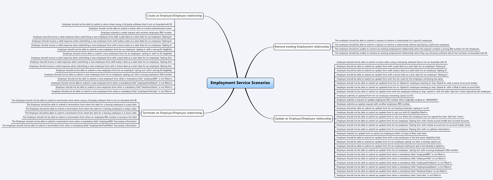

# Employee Details (ED) Software Development Kit (SDK)

Employers can send us changes to employee details using the Employment service.

### Latest Release V 2.0 - [view details](#V-2.0-update-details)

### Archive 
* [Employee Details V 1](../Archive/V1/Employee%20Details)

## Key documentation

- Business use cases
	- [Download and view](../Payday%20filing%20-%20ED%20and%20EI%20GWS%20business%20use%20cases.pdf)
	
- Schemas and WSDLs
	- View and download the [Common v2 XSD](../../Common%20XSD/Common.v2.xsd)
	- View and download the [Return Service Common v2 XSD](../../Common%20XSD/ReturnCommon.v2.xsd)
	- View and download the Employee Details (ED) [v2 XSD](Employment.v2.xsd) and [v2 WSDL](EmploymentV2DevWsdl.wsdl) from this current directory
	
- Build pack 
	- [Download the Employment Service build pack](Gateway%20Services%20Build%20Pack%20-%20Employment%20Service%20v2.pdf) to view data definitions of each operation and response status code definitions
	
- Message samples
    - [View message samples for requests and positive responses](#message-samples)
	
- Find out about [Employment Information SDK](../Employment%20Information)

## Environment information

- [Mock environment information - emulated services](#mock-environment-information)

- [Test environment information - test scenarios, mind map and URL endpoints](#test-environment-information)

- [Production environment information - URL endpoints](#Production-Environment-Information)	

## Supporting services

* [Service: Identity and Access](https://github.com/InlandRevenue/Gateway_Services-Access/tree/master/Identity%20and%20Access) – view how to integrate, OAuth requests and responses message samples and build pack
* [Service: Intermediation](https://github.com/InlandRevenue/Gateway_Services-Access/tree/master/Service%20-%20Intermediation)

## V 2.0 update details
-----------------

The following key changes have been made to the Employment Service for the update to V2.0.

* URL endpoint updated
	* Version 2 Employment Service has a [new URL endpoint](#Production-environment-information).  

* Operations
	* Updated schema references from ‘Employment.xsd’ to ‘Employment.v2.xsd’

* Create
	* Updated ‘KiwiSaverStatus’, changed valid options to: AK, OK, NK, CT, AE(Removed: OT, NM, CH)
	* Added new field EmployeeExemptIncome
	* Updated employeeNameOnEILine to allow 255 characters, previously this was 20
	* Added tax codes table to show valid tax codes. ESS, SLCIR, and SLBOR are no longer valid tax codes
	* Updated employeeKiwiSaverEligibility to use codes NE, EE, and EA. Add table of codes below fields

* Update
	* Removed ‘KiwiSaverStatus’ field as it is no longer used for the Update operation
	* Added new optional field ‘lateOptOutReason’
	* Added new optional field ‘otherLateOptOutReason’ field
	* Updated employeeNameOnEILinein updateBody and in employeeIdentifierto allow 255 characters, previously this was 20
	* Updated employeeKiwiSaverEligibility to use codes NE, EE, and EA. Add table of codes below fields.	
	
* RetrieveList
	* Updated employeeNameOnEILine to allow 255 characters, previously this was 20

* Response codes
	* Deleted codes 119, 120, 123 as they correspond to web request processing
	* Added code 124: ‘The start and/or stop date overlaps with multiple other records’
	* Added code 130: ‘The provided KiwiSaverStatus is not valid’. This response is returned when KiwiSaver Status is not one of the following values: AK, OK, NK, CT, AE. 
	* Added code 131: ‘The provided Employee Exempt Income type is not valid’. This response is returned when Exempt Income type is not one of the following: BLH, HPT, OES, RTA, TAO, VBS.
	* Added code 132: ‘The provided KiwiSaver Late Opt-Out Reason is invalid’
	* Added code 133: ‘Other Late Opt-Out Reason must be provided’
	* Added code 134: ‘Opt-Out is late, so other reason must be provided’
	* Added code 135: ‘Opt-Out must be set to true as lateOptOutReason has been provided’
	* Added code 136: ‘The provided employeeKiwiSaverEligibility status was invalid’

## Message samples
-----------------

- Simulating Employment Service operations:
    - Create
        - Positive response
            - [request sample](sample%20messages/body-employment-create-request.xml)
            - [response sample](sample%20messages/body-employment-create-response.xml)
    - Terminate
        - Positive response
            - [request sample](sample%20messages/body-employment-terminate-request.xml)
            - [response sample](sample%20messages/body-employment-terminate-response.xml)
    - Update
        - Positive response
            - [request sample](sample%20messages/body-employment-update-request.xml)
            - [response sample](sample%20messages/body-employment-update-response.xml)
    - RetrieveList
        - Positive response
            - [request sample](sample%20messages/body-employment-retrievelist-request.xml)
            - [response sample](sample%20messages/body-employment-retrievelist-response.xml)

## Mock environment information
-----------------

- Mock URL endpoint
    - https://mock-es.ird.digitalpartner.services/

* Test scenarios 
	- Employee Details test scenarios mind map
	
	

*  Test data
	- The following test data can be tested in our Mock Services environment when submitting requests to the service operations
	- This table shows which scenarios (as per their numbers in the mindmap) require specific data to trigger the expected responses. 
	- Text in italics represents the name of the XML node in the request.
	
	
	Operation | Scenario ID | Data
	--- | --- | ---
	RetrieveList | EMS_ES081 | Employee IRD (*identifier*): 123114116
	Update | EMS_ES096 | Employee IRD (*identifier*): 123183711
	Create | EMS_ES095 | Employee IRD (*identifier*): 123183711
	Update | EMS_ES099 | employmentStartDate: today's date

## Test environment information
-----------------

* Test scenarios
	- [Download the test scenarios report template](Payday%20Filing%20ED%20-%20Test%20Report%20Template.docx)

* Test URL endpoint
    - Cloud gateway service: https://test5.services.ird.govt.nz:4046/gateway/gws/employment/
    - Native desktop gateway service: https://test5.services.ird.govt.nz/gateway2/gws/employment/
	- Cloud SOAP WSDL: https://test5.services.ird.govt.nz:4046/gateway/gws/employment/?wsdl
	- Native desktop SOAP WSDL: https://test5.services.ird.govt.nz/gateway2/gws/employment/?wsdl
            
* Test URL endpoint **V2**
    - Cloud gateway service: https://test5.services.ird.govt.nz:4046/gateway/gws/employment/v2/
    - Native desktop gateway service: https://test5.services.ird.govt.nz/gateway2/gws/employment/v2/
	- Cloud SOAP WSDL: https://test5.services.ird.govt.nz:4046/gateway/gws/employment/v2/?wsdl
	- Native desktop SOAP WSDL: https://test5.services.ird.govt.nz/gateway2/gws/employment/v2/?wsdl

## Production environment information
-----------------

* Production URL endpoint
	- Cloud gateway service: https://services.ird.govt.nz:4046/gateway/gws/employment/
	- Native desktop gateway service: https://services.ird.govt.nz/gateway2/gws/employment/
	- Cloud SOAP WSDL: https://services.ird.govt.nz:4046/gateway/gws/employment/?wsdl
	- Native desktop SOAP WSDL: https://services.ird.govt.nz/gateway2/gws/employment/?wsdl
	
* Production URL endpoint **V2**
	- Cloud gateway service: https://services.ird.govt.nz:4046/gateway/gws/employment/v2/
	- Native desktop gateway service: https://services.ird.govt.nz/gateway2/gws/employment/v2/
	- Cloud SOAP WSDL: https://services.ird.govt.nz:4046/gateway/gws/employment/v2/?wsdl
	- Native desktop SOAP WSDL: https://services.ird.govt.nz/gateway2/gws/employment/v2/?wsdl	